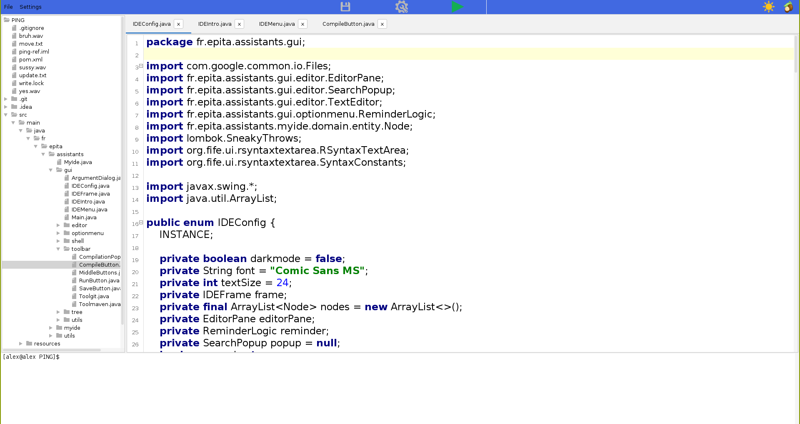
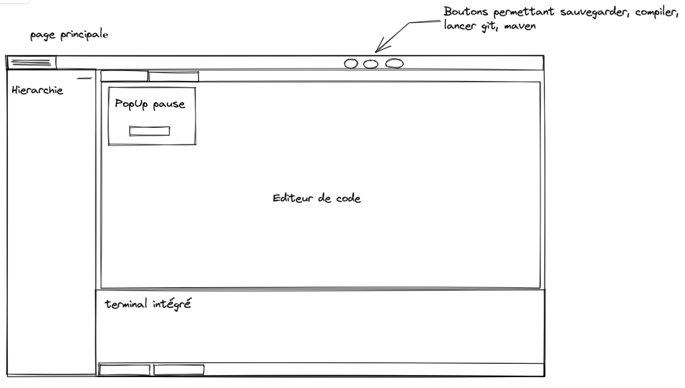
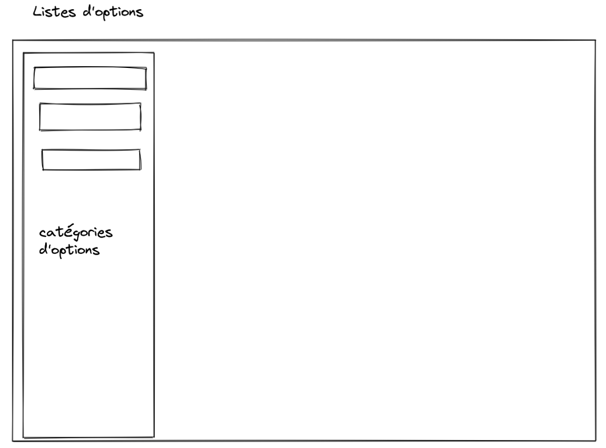
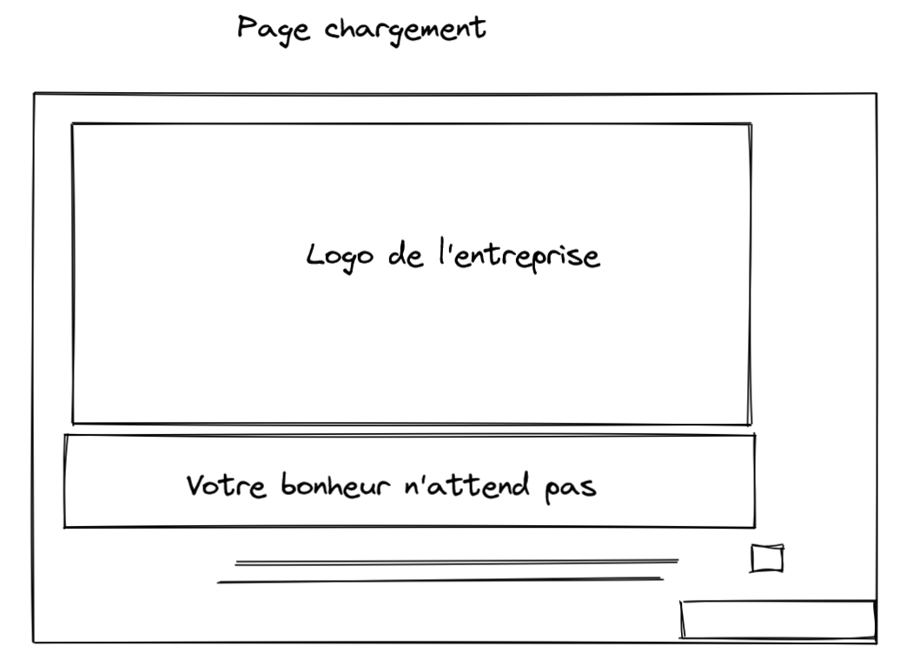

# BolIDE

A custom-made IDE to improve the working conditions and increase the happiness of
it's developers.
Reports about the project (in french) are located in french_reports/

## Features

### Editor:
- Syntaxic coloration
- Auto-identation
- Font choice
- Search and Replace

### Logic:
- Loading projects and editing files
- Support editing multiple files at the same time
- File hierarchy
- Embedded Shell
- Maven projects support (compile, clean, test, package, install, exec, tree)
- Git interface (add, commit, pull, push)

### Custom
- Configurable pause pop-up to remind the developer to take a break
- Light and Dark theme
- Custom names and logo for git and maven command:
    - Git -> Hapiness  
    - Add -> amplify | Commit -> pledge | Pull -> attract | Push -> send  
    - Maven -> Pleasure  
    - Compile | Clean | Test -> experiment | Package -> wrap | Install -> Introduce | Exec -> Achieve | Tree -> Conifer

## Screenshots:

### Dark theme:

### Light theme:

## Design documents (French):

### Main window:

### Options:

### Loading project:

